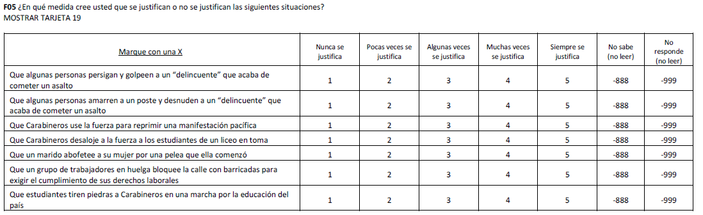

```{r}
pacman::p_load(ggplot2,
               hrbrthemes,
               sjPlot,
               sjlabelled,
               lavaan,
               psych,
               corrplot,
               haven,
               dplyr)
```

```{r}
load("../input/data-proc/paces_est.rda")
load("../input/data-proc/paces_apod.rda")
load("../input/data-proc/iccs2016.rda")
```

# Sentido de autoeficacia política
## PACES: estudiantes
### Descriptivo
```{r}
est_autpol=paces_est %>% dplyr::select(aut_pol1, aut_pol2, aut_pol3, aut_pol4, aut_pol5, aut_pol6) %>% as.data.frame()

graf_autpol_est <- sjPlot::plot_likert(est_autpol,
  groups = NULL,
  groups.titles = "auto",
  title = "¿Cuán de acuerdo o en desacuerdo estás con las siguientes afirmaciones acerca de ti y la política?",
  legend.title = NULL,
  legend.labels = c("Muy en desacuerdo", "En desacuerdo", "De acuerdo", "Muy de acuerdo"),
  axis.titles = NULL,
  axis.labels = NULL,
  catcount = 4,
  cat.neutral = NULL,
  sort.frq = NULL,
  weight.by = paces_est$pond_estudiante_reg_dep_tens,
  title.wtd.suffix = NULL,
  wrap.title = 55,
  wrap.labels = 36,
  geom.size = 0.8,
  geom.colors ="Purples",
  reverse.colors = FALSE,
  values = "sum.outside",
  show.n = F,
  show.legend = TRUE,
  show.prc.sign = T,
  grid.range = 1.2,
  grid.breaks = 0.5,
  expand.grid = FALSE,
  digits = 0,
  reverse.scale = TRUE,
  coord.flip = TRUE,
  sort.groups = TRUE,
  rel_heights = 1,
  group.legend.options = list(nrow = NULL, byrow = TRUE),
  cowplot.options = list(label_x = 0.01, hjust = 0.5, vjust=0.5, align = "v")) + theme_bw() + theme(plot.title = element_text(size=14, face = "bold", hjust=0.5),
                      axis.text.y = element_text(size=10, face = "bold"), legend.position = "bottom", legend.text = element_text(size=10, face="bold"))

ggsave(graf_autpol_est, file = "../output/autoeficacia_politica_estudiantes.png",device = "png",width = 21,height = 16,dpi = "retina",units = "cm")
```
### Bivariado
```{r}
polychoric(est_autpol)
png("../output/cor_est_autpol.png",width=600,height=600)
corrplot.mixed(cor(est_autpol, use = "na.or.complete", method="spearman"))
dev.off()
```
### Fiabilidad: alpha de cronbach
```{r}
alpha(est_autpol)
```
### Validez modelo de medida
```{r}
cfa_1 <- 'aut_pol =~ aut_pol1 + aut_pol2 + aut_pol3 + aut_pol4 + aut_pol5 + aut_pol6'
fit_1 <- cfa(cfa_1,data=est_autpol,estimator="DWLS")
show(fit_1) # Resumen ajuste general
fitMeasures(fit_1, c("chisq", "df", "pvalue", "cfi", "tli", "rmsea"))
summary(fit_1, fit.measures=T, standardized=T)

cfa_2 <- 'aut_pol =~ aut_pol1 + aut_pol2 + aut_pol3 + aut_pol4 + aut_pol6'
fit_2 <- cfa(cfa_2,data=est_autpol,estimator="DWLS")
show(fit_2) # Resumen ajuste general
fitMeasures(fit_2, c("chisq", "df", "pvalue", "cfi", "tli", "rmsea"))
summary(fit_2, fit.measures=T, standardized=T)

anova(fit_1, fit_2)
```
## PACES: apoderados
### Descriptivo
```{r}
apod_autpol=paces_apod %>% dplyr::select(aut_pol1, aut_pol2, aut_pol3, aut_pol4, aut_pol5, aut_pol6) %>% as.data.frame()

graf_autpol_apod <- plot_likert(apod_autpol,
  groups = NULL,
  groups.titles = "auto",
  title = "¿Cuán de acuerdo o en desacuerdo está usted con las siguientes afirmaciones acerca de usted y la política?",
  legend.title = NULL,
  legend.labels = c("Muy en desacuerdo", "En desacuerdo", "De acuerdo", "Muy de acuerdo"),
  axis.titles = NULL,
  axis.labels = NULL,
  catcount = 4,
  cat.neutral = NULL,
  sort.frq = NULL,
  weight.by = paces_apod$pond_apoderado_reg_dep_tens,
  title.wtd.suffix = NULL,
  wrap.title = 55,
  wrap.labels = 36,
  geom.size = 0.8,
  geom.colors ="Purples",
  reverse.colors = FALSE,
  values = "sum.outside",
  show.n = F,
  show.legend = TRUE,
  show.prc.sign = T,
  grid.range = 1.2,
  grid.breaks = 0.5,
  expand.grid = FALSE,
  digits = 0,
  reverse.scale = TRUE,
  coord.flip = TRUE,
  sort.groups = TRUE,
  rel_heights = 1,
  group.legend.options = list(nrow = NULL, byrow = TRUE),
  cowplot.options = list(label_x = 0.01, hjust = 0.5, vjust=0.5, align = "v")) + theme_bw() + theme(plot.title = element_text(size=14, face = "bold", hjust=0.5),
  axis.text.y = element_text(size=10, face = "bold"), legend.position = "bottom", legend.text = element_text(size=10, face="bold"))

ggsave(graf_autpol_apod, file = "../output/autoeficacia_politica_apoderados.png",device = "png",width = 21,height = 16,dpi = "retina",units = "cm")
```
### Bivariado
```{r}
polychoric(apod_autpol)
png("../output/cor_apod_autpol.png",width=600,height=600) #el indicador "aut_pol5" es el que tiene una correlación más baja con las demás
corrplot.mixed(cor(apod_autpol, use = "na.or.complete", method="spearman"))
dev.off()
```
### Fiabilidad: alpha de cronbach
```{r}
alpha(apod_autpol)
```
### Validez modelo de medida
```{r}
cfa_1 <- 'aut_pol =~ aut_pol1 + aut_pol2 + aut_pol3 + aut_pol4 + aut_pol5 + aut_pol6'
fit_1 <- cfa(cfa_1,data=apod_autpol,estimator="DWLS")
show(fit_1) # Resumen ajuste general
fitMeasures(fit_1, c("chisq", "df", "pvalue", "cfi", "tli", "rmsea"))
summary(fit_1, fit.measures=T, standardized=T)

cfa_2 <- 'aut_pol =~ aut_pol1 + aut_pol2 + aut_pol3 + aut_pol4 + aut_pol6'
fit_2 <- cfa(cfa_2,data=apod_autpol,estimator="DWLS")
show(fit_2) # Resumen ajuste general
fitMeasures(fit_2, c("chisq", "df", "pvalue", "cfi", "tli", "rmsea"))
summary(fit_2, fit.measures=T, standardized=T)

anova(fit_1, fit_2)
```
Se podría excluir el indicador número 5, manteniendo un buen ajuste del modelo.

# Actitudes hacia la igualdad con grupos étnicos
## Descriptivo
```{r}
iccs_igualdad=iccs2016 %>% dplyr::select(Ig_etn1, Ig_etn2, Ig_etn3, Ig_etn4, Ig_etn5) %>% as.data.frame()

graf_grupos_etnicos <- sjPlot::plot_likert(iccs_igualdad,
  groups = NULL,
  groups.titles = "auto",
  title = "Existen diferentes puntos de vista sobre los derechos y responsabilidades de los diferentes en la sociedad. ¿Cuán de acuerdo o en desacuerdo estás tú con las siguientes declaraciones?",
  legend.title = NULL,
  legend.labels = c("Muy de acuerdo", "De acuerdo", "En desacuerdo","Muy en desacuerdo"),
  axis.titles = NULL,
  axis.labels = NULL,
  catcount = 4,
  cat.neutral = NULL,
  sort.frq = NULL,
  title.wtd.suffix = NULL,
  wrap.title = 55,
  wrap.labels = 36,
  geom.size = 0.8,
  geom.colors ="Purples",
  reverse.colors = TRUE,
  values = "sum.outside",
  show.n = F,
  show.legend = TRUE,
  show.prc.sign = T,
  grid.range = 1.2,
  grid.breaks = 0.5,
  expand.grid = FALSE,
  digits = 0,
  reverse.scale = TRUE,
  coord.flip = TRUE,
  sort.groups = TRUE,
  rel_heights = 1,
  group.legend.options = list(nrow = NULL, byrow = TRUE),
  cowplot.options = list(label_x = 0.01, hjust = 0.5, vjust=0.5, align = "v")) + theme_bw() + theme(plot.title = element_text(size=14, face = "bold", hjust=0.5),
                      axis.text.y = element_text(size=10, face = "bold"), legend.position = "bottom", legend.text = element_text(size=10, face="bold"))

ggsave(graf_grupos_etnicos, file = "../output/igualdad_grupos_etnicos.png",device = "png",width = 21,height = 16,dpi = "retina",units = "cm")
```
## Bivariado
```{r}
polychoric(iccs_igualdad)
png("../output/cor_ig_grupos_etnicos.png",width=600,height=600) 
corrplot.mixed(cor(iccs_igualdad, use = "na.or.complete", method="spearman"))
dev.off()
```
### Fiabilidad: alpha de cronbach
```{r}
alpha(iccs_igualdad)
```
### Validez modelo de medida
```{r}
cfa_1 <- 'ig_etn =~ Ig_etn1 + Ig_etn2 + Ig_etn3 + Ig_etn4 + Ig_etn5'
fit_1 <- cfa(cfa_1,data=iccs_igualdad,estimator="DWLS")
show(fit_1) # Resumen ajuste general
fitMeasures(fit_1, c("chisq", "df", "pvalue", "cfi", "tli", "rmsea"))
summary(fit_1, fit.measures=T, standardized=T)

cfa_2 <- 'ig_etn =~ Ig_etn1 + Ig_etn2 + Ig_etn3 + Ig_etn5'
fit_2 <- cfa(cfa_2,data=iccs_igualdad,estimator="DWLS")
show(fit_2) # Resumen ajuste general
fitMeasures(fit_2, c("chisq", "df", "pvalue", "cfi", "tli", "rmsea"))
summary(fit_2, fit.measures=T, standardized=T)

anova(fit_1,fit_2)
```
Se podría excluir el indicador número 4, manteniendo un buen ajuste del modelo.

# Actitudes hacia la igualdad de género
## PACES: estudiantes
### Descriptivo
```{r}
est_igualdad=paces_est %>% dplyr::select(Igualdad1, Igualdad5, Igualdad7, Igualdad3, Igualdad4, Igualdad6, Igualdad2, Igualdad8, Igualdad9) %>% as.data.frame()

graf_igualdad_est <- sjPlot::plot_likert(est_igualdad,
  groups = NULL,
  groups.titles = "auto",
  title = "Existen diferentes visiones sobre el papel de las mujeres y los hombres en la sociedad. ¿Cuán de acuerdo o en desacuerdo estás con las siguientes afirmaciones?",
  legend.title = NULL,
  legend.labels = c("Muy en desacuerdo", "En desacuerdo", "De acuerdo", "Muy de acuerdo"),
  axis.titles = NULL,
  axis.labels = NULL,
  catcount = 4,
  cat.neutral = NULL,
  sort.frq = NULL,
  weight.by = paces_est$pond_estudiante_reg_dep_tens,
  title.wtd.suffix = NULL,
  wrap.title = 55,
  wrap.labels = 36,
  geom.size = 0.8,
  geom.colors ="Purples",
  reverse.colors = FALSE,
  values = "sum.outside",
  show.n = F,
  show.legend = TRUE,
  show.prc.sign = T,
  grid.range = 1.2,
  grid.breaks = 0.5,
  expand.grid = FALSE,
  digits = 0,
  reverse.scale = TRUE,
  coord.flip = TRUE,
  sort.groups = TRUE,
  rel_heights = 1,
  group.legend.options = list(nrow = NULL, byrow = TRUE),
  cowplot.options = list(label_x = 0.01, hjust = 0.5, vjust=0.5, align = "v")) + theme_bw() + theme(plot.title = element_text(size=14, face = "bold", hjust=0.5),
                      axis.text.y = element_text(size=10, face = "bold"), legend.position = "bottom", legend.text = element_text(size=10, face="bold"))

ggsave(graf_igualdad_est, file = "../output/igualdad_de_genero_estudiantes.png",device = "png",width = 21,height = 18,dpi = "retina",units = "cm")
```
### Bivariado
```{r}
polychoric(est_igualdad)
png("../output/cor_ig_genero_est.png",width=600,height=600) 
corrplot.mixed(cor(est_igualdad, use = "na.or.complete", method="spearman"))
dev.off()
```
### Fiabilidad: alpha de cronbach
```{r}
alpha(est_igualdad)
```
#### Por dimensión
##### Igualdad de derechos y oportunidades
```{r}
est_ig_der=paces_est %>% dplyr::select(Igualdad1, Igualdad5, Igualdad7) %>% as.data.frame()
alpha(est_ig_der)
```
##### Distribución igualitaria de roles en la esfera pública
```{r}
est_ig_pub=paces_est %>% dplyr::select(Igualdad3, Igualdad4, Igualdad6) %>% as.data.frame()
alpha(est_ig_pub)
```
##### Distribución igualitaria de roles en la esfera privada
```{r}
est_ig_priv=paces_est %>% dplyr::select(Igualdad2, Igualdad8, Igualdad9) %>% as.data.frame()
alpha(est_ig_priv)
```
### Validez modelo de medida
```{r}
cfa_1 <- 'general =~ Igualdad1 + Igualdad5 + Igualdad7 + Igualdad3 + Igualdad4 + Igualdad6 + Igualdad2 + Igualdad8 + Igualdad9'
fit_1 <- cfa(cfa_1,data=est_igualdad,estimator="DWLS")
show(fit_1) # Resumen ajuste general
fitMeasures(fit_1, c("chisq", "df", "pvalue", "cfi", "tli", "rmsea"))
summary(fit_1, fit.measures=T, standardized=T)

cfa_2 <- 'ig_gen =~ Igualdad1 + Igualdad5 + Igualdad7
ig_pub =~ Igualdad3 + Igualdad4 + Igualdad6 
ig_priv =~ Igualdad2 + Igualdad8 + Igualdad9'
fit_2 <- cfa(cfa_2,data=est_igualdad,estimator="DWLS")
show(fit_2) # Resumen ajuste general
fitMeasures(fit_2, c("chisq", "df", "pvalue", "cfi", "tli", "rmsea"))
summary(fit_2, fit.measures=T, standardized=T)
anova(fit_1,fit_2)

cfa_3 <- 'ig_pub =~ Igualdad3 + Igualdad4 + Igualdad6 
ig_priv =~ Igualdad2 + Igualdad8 + Igualdad9'
fit_3 <- cfa(cfa_3,data=est_igualdad,estimator="DWLS")
show(fit_3) # Resumen ajuste general
fitMeasures(fit_3, c("chisq", "df", "pvalue", "cfi", "tli", "rmsea"))
summary(fit_3, fit.measures=T, standardized=T)
anova(fit_2,fit_3)
```
## PACES: apoderados
### Descriptivo
```{r}
apod_igualdad=paces_apod %>% dplyr::select(Igualdad1, Igualdad5, Igualdad7, Igualdad3, Igualdad4, Igualdad6, Igualdad2, Igualdad8, Igualdad9) %>% as.data.frame()

graf_igualdad_apod <- plot_likert(apod_igualdad,
  groups = NULL,
  groups.titles = "auto",
  title = "Existen diferentes visiones sobre el papel de las mujeres y los hombres en la sociedad. ¿Cuán de acuerdo o en desacuerdo estás con las siguientes afirmaciones?",
  legend.title = NULL,
  legend.labels = c("Muy en desacuerdo", "En desacuerdo", "De acuerdo", "Muy de acuerdo"),
  axis.titles = NULL,
  axis.labels = NULL,
  catcount = 4,
  cat.neutral = NULL,
  sort.frq = NULL,
  weight.by = paces_apod$pond_apoderado_reg_dep_tens,
  title.wtd.suffix = NULL,
  wrap.title = 55,
  wrap.labels = 36,
  geom.size = 0.8,
  geom.colors ="Purples",
  reverse.colors = FALSE,
  values = "sum.outside",
  show.n = F,
  show.legend = TRUE,
  show.prc.sign = T,
  grid.range = 1.2,
  grid.breaks = 0.5,
  expand.grid = FALSE,
  digits = 0,
  reverse.scale = TRUE,
  coord.flip = TRUE,
  sort.groups = TRUE,
  rel_heights = 1,
  group.legend.options = list(nrow = NULL, byrow = TRUE),
  cowplot.options = list(label_x = 0.01, hjust = 0.5, vjust=0.5, align = "v")) + theme_bw() + theme(plot.title = element_text(size=14, face = "bold", hjust=0.5),
  axis.text.y = element_text(size=10, face = "bold"), legend.position = "bottom", legend.text = element_text(size=10, face="bold"))

ggsave(graf_igualdad_apod, file = "../output/igualdad_de_genero_apoderados.png",device = "png",width = 21,height = 18,dpi = "retina",units = "cm")
```
### Bivariado
```{r}
polychoric(apod_igualdad)
png("../output/cor_ig_genero_apod.png",width=600,height=600) 
corrplot.mixed(cor(apod_igualdad, use = "na.or.complete", method="spearman"))
dev.off()
```
### Fiabilidad: alpha de cronbach
```{r}
alpha(apod_igualdad)
```
### Validez modelo de medida
```{r}
cfa_1 <- 'general =~ Igualdad1 + Igualdad5 + Igualdad7 + Igualdad3 + Igualdad4 + Igualdad6 + Igualdad2 + Igualdad8 + Igualdad9'
fit_1 <- cfa(cfa_1,data=apod_igualdad,estimator="DWLS")
show(fit_1) # Resumen ajuste general
fitMeasures(fit_1, c("chisq", "df", "pvalue", "cfi", "tli", "rmsea"))
summary(fit_1, fit.measures=T, standardized=T)

cfa_2 <- 'ig_gen =~ Igualdad1 + Igualdad5 + Igualdad7
ig_pub =~ Igualdad3 + Igualdad4 + Igualdad6 
ig_priv =~ Igualdad2 + Igualdad8 + Igualdad9'
fit_2 <- cfa(cfa_2,data=apod_igualdad,estimator="DWLS")
show(fit_2) # Resumen ajuste general
fitMeasures(fit_2, c("chisq", "df", "pvalue", "cfi", "tli", "rmsea"))
summary(fit_2, fit.measures=T, standardized=T)
anova(fit_1,fit_2)

cfa_3 <- 'ig_pub =~ Igualdad3 + Igualdad4 + Igualdad6 
ig_priv =~ Igualdad2 + Igualdad8 + Igualdad9'
fit_3 <- cfa(cfa_3,data=apod_igualdad,estimator="DWLS")
show(fit_3) # Resumen ajuste general
fitMeasures(fit_3, c("chisq", "df", "pvalue", "cfi", "tli", "rmsea"))
summary(fit_3, fit.measures=T, standardized=T)
anova(fit_2,fit_3)
```
En función de los resultados (tanto en población adulta como en población joven), si bien la medición con las tres dimensiones tiene un ajuste un poco mejor, la prueba de anova nos indica que la diferencia en el ajuste con el modelo que excluye tres indicadores (y, por ende, una de las dimensiones) no es estadísticamente significativa. En consecuencia, se sugiere eliminar los tres indicadores correspondientes a la dimensión de igualdad de derechos y oportunidades entre hombres y mujeres.

# Actitudes hacia la igualdad con inmigrantes
## PACES: estudiantes
### Descriptivo
```{r}
est_igualdad_inm=paces_est %>% dplyr::select(Ig_inm1,Ig_inm2, Ig_inm3, Ig_inm4, Ig_inm5, Ig_inm6, Ig_inm7, Ig_inm8) %>% as.data.frame()

graf_igualdad_inm_est <- sjPlot::plot_likert(est_igualdad_inm,
  groups = NULL,
  groups.titles = "auto",
  title = "¿Cuán de acuerdo o en desacuerdo estás con las siguientes afirmaciones sobre los inmigrantes?",
  legend.title = NULL,
  legend.labels = c("Muy en desacuerdo", "En desacuerdo", "De acuerdo", "Muy de acuerdo"),
  axis.titles = NULL,
  axis.labels = NULL,
  catcount = 4,
  cat.neutral = NULL,
  sort.frq = NULL,
  weight.by = paces_est$pond_estudiante_reg_dep_tens,
  title.wtd.suffix = NULL,
  wrap.title = 55,
  wrap.labels = 36,
  geom.size = 0.8,
  geom.colors ="Purples",
  reverse.colors = FALSE,
  values = "sum.outside",
  show.n = F,
  show.legend = TRUE,
  show.prc.sign = T,
  grid.range = 1.2,
  grid.breaks = 0.5,
  expand.grid = FALSE,
  digits = 0,
  reverse.scale = TRUE,
  coord.flip = TRUE,
  sort.groups = TRUE,
  rel_heights = 1,
  group.legend.options = list(nrow = NULL, byrow = TRUE),
  cowplot.options = list(label_x = 0.01, hjust = 0.5, vjust=0.5, align = "v")) + theme_bw() + theme(plot.title = element_text(size=14, face = "bold", hjust=0.5),
                      axis.text.y = element_text(size=10, face = "bold"), legend.position = "bottom", legend.text = element_text(size=10, face="bold"))

ggsave(graf_igualdad_inm_est, file = "../output/igualdad__inmigrantes_estudiantes.png",device = "png",width = 21,height = 16,dpi = "retina",units = "cm")
```
### Bivariado
```{r}
polychoric(est_igualdad_inm)
png("../output/cor_ig_inm_est.png",width=600,height=600) 
corrplot.mixed(cor(est_igualdad_inm, use = "na.or.complete", method="spearman"))
dev.off()
```
### Fiabilidad: alpha de cronbach
```{r}
alpha(est_igualdad_inm)
```
#### Por dimensión
##### Actitudes positivas
```{r}
est_ig_inm_pos=paces_est %>% dplyr::select(Ig_inm1,Ig_inm2, Ig_inm3, Ig_inm4, Ig_inm5) %>% as.data.frame()
alpha(est_ig_inm_pos)
```
##### Actitudes negativas
```{r}
est_ig_inm_neg=paces_est %>% dplyr::select(Ig_inm6, Ig_inm7, Ig_inm8) %>% as.data.frame()
alpha(est_ig_inm_neg)
```

### Validez modelo de medida
```{r}
cfa_1 <- 'general =~ Ig_inm1 + Ig_inm2 + Ig_inm3 + Ig_inm4 + Ig_inm5 + Ig_inm6 + Ig_inm7 + Ig_inm8'
fit_1 <- cfa(cfa_1,data=est_igualdad_inm,estimator="DWLS")
show(fit_1) # Resumen ajuste general
fitMeasures(fit_1, c("chisq", "df", "pvalue", "cfi", "tli", "rmsea"))
summary(fit_1, fit.measures=T, standardized=T)

cfa_2 <- 'inm_pos =~ Ig_inm1 + Ig_inm2 + Ig_inm3 + Ig_inm4 + Ig_inm5
inm_neg =~ Ig_inm6 + Ig_inm7 + Ig_inm8'
fit_2 <- cfa(cfa_2,data=est_igualdad_inm,estimator="DWLS")
show(fit_2) # Resumen ajuste general
fitMeasures(fit_2, c("chisq", "df", "pvalue", "cfi", "tli", "rmsea"))
summary(fit_2, fit.measures=T, standardized=T)
anova(fit_1,fit_2)

cfa_3 <- 'general =~ Ig_inm1 + Ig_inm2 + Ig_inm3 + Ig_inm4 + Ig_inm5'
fit_3 <- cfa(cfa_3,data=est_igualdad_inm,estimator="DWLS")
show(fit_3) # Resumen ajuste general
fitMeasures(fit_3, c("chisq", "df", "pvalue", "cfi", "tli", "rmsea"))
summary(fit_3, fit.measures=T, standardized=T)
anova(fit_2,fit_3)
```
## PACES: apoderados
### Descriptivo
```{r}
apod_igualdad_inm=paces_apod %>% dplyr::select(Ig_inm1,Ig_inm2, Ig_inm3, Ig_inm4, Ig_inm5, Ig_inm6, Ig_inm7, Ig_inm8) %>% as.data.frame()

graf_igualdad_inm_apod <- plot_likert(apod_igualdad_inm,
  groups = NULL,
  groups.titles = "auto",
  title = "¿Cuán de acuerdo o en desacuerdo está usted con las siguientes afirmaciones sobre los inmigrantes?",
  legend.title = NULL,
  legend.labels = c("Muy en desacuerdo", "En desacuerdo", "De acuerdo", "Muy de acuerdo"),
  axis.titles = NULL,
  axis.labels = NULL,
  catcount = 4,
  cat.neutral = NULL,
  sort.frq = NULL,
  weight.by = paces_apod$pond_apoderado_reg_dep_tens,
  title.wtd.suffix = NULL,
  wrap.title = 55,
  wrap.labels = 36,
  geom.size = 0.8,
  geom.colors ="Purples",
  reverse.colors = FALSE,
  values = "sum.outside",
  show.n = F,
  show.legend = TRUE,
  show.prc.sign = T,
  grid.range = 1.2,
  grid.breaks = 0.5,
  expand.grid = FALSE,
  digits = 0,
  reverse.scale = TRUE,
  coord.flip = TRUE,
  sort.groups = TRUE,
  rel_heights = 1,
  group.legend.options = list(nrow = NULL, byrow = TRUE),
  cowplot.options = list(label_x = 0.01, hjust = 0.5, vjust=0.5, align = "v")) + theme_bw() + theme(plot.title = element_text(size=14, face = "bold", hjust=0.5),
  axis.text.y = element_text(size=10, face = "bold"), legend.position = "bottom", legend.text = element_text(size=10, face="bold"))

ggsave(graf_igualdad_inm_apod, file = "../output/igualdad_inmigrantes_apoderados.png",device = "png",width = 21,height = 16,dpi = "retina",units = "cm")
```
### Bivariado
```{r}
polychoric(apod_igualdad_inm)
png("../output/cor_ig_inm_apod.png",width=600,height=600) 
corrplot.mixed(cor(apod_igualdad_inm, use = "na.or.complete", method="spearman"))
dev.off()
```
### Fiabilidad: alpha de cronbach
```{r}
alpha(apod_igualdad_inm)
```
#### Por dimensión
##### Actitudes positivas
```{r}
apod_ig_inm_pos=paces_apod %>% dplyr::select(Ig_inm1,Ig_inm2, Ig_inm3, Ig_inm4, Ig_inm5) %>% as.data.frame()
alpha(apod_ig_inm_pos)
```
##### Actitudes negativas
```{r}
apod_ig_inm_neg=paces_apod %>% dplyr::select(Ig_inm6, Ig_inm7, Ig_inm8) %>% as.data.frame()
alpha(apod_ig_inm_neg)
```
### Validez modelo de medida
```{r}
cfa_1 <- 'general =~ Ig_inm1 + Ig_inm2 + Ig_inm3 + Ig_inm4 + Ig_inm5 + Ig_inm6 + Ig_inm7 + Ig_inm8'
fit_1 <- cfa(cfa_1,data=apod_igualdad_inm,estimator="DWLS")
show(fit_1) # Resumen ajuste general
fitMeasures(fit_1, c("chisq", "df", "pvalue", "cfi", "tli", "rmsea"))
summary(fit_1, fit.measures=T, standardized=T)

cfa_2 <- 'inm_pos =~ Ig_inm1 + Ig_inm2 + Ig_inm3 + Ig_inm4 + Ig_inm5
inm_neg =~ Ig_inm6 + Ig_inm7 + Ig_inm8'
fit_2 <- cfa(cfa_2,data=apod_igualdad_inm,estimator="DWLS")
show(fit_2) # Resumen ajuste general
fitMeasures(fit_2, c("chisq", "df", "pvalue", "cfi", "tli", "rmsea"))
summary(fit_2, fit.measures=T, standardized=T)
anova(fit_1,fit_2)

cfa_3 <- 'general =~ Ig_inm1 + Ig_inm2 + Ig_inm3 + Ig_inm4 + Ig_inm5'
fit_3 <- cfa(cfa_3,data=apod_igualdad_inm,estimator="DWLS")
show(fit_3) # Resumen ajuste general
fitMeasures(fit_3, c("chisq", "df", "pvalue", "cfi", "tli", "rmsea"))
summary(fit_3, fit.measures=T, standardized=T)
anova(fit_2,fit_3)
```
La medición con las dos dimensiones tiene un ajuste un poco mejor en población adulta y un poco peor en población joven. Sin embargo, en ambos casos la prueba de anova nos indica que la diferencia en el ajuste con el modelo que excluye tres indicadores (y, por ende, una de las dimensiones) no es estadísticamente significativa. En consecuencia, se sugiere eliminar los tres indicadores correspondientes a la dimensión de "actitudes negativas".

# Creencias autoritarias
## PACES: estudiantes
### Descriptivo
```{r}
est_creencias_autoritarias=paces_est %>% dplyr::select(autorit1, autorit2, autorit3, autorit4, autorit5, autorit6, autorit7, autorit8, autorit9) %>% as.data.frame()

graf_creencias_autoritarias_est <- sjPlot::plot_likert(est_creencias_autoritarias,
  groups = NULL,
  groups.titles = "auto",
  title = "¿Qué tan de acuerdo o en desacuerdo estás con las siguientes afirmaciones sobre los gobiernos y sus líderes?",
  legend.title = NULL,
  legend.labels = c("Muy en desacuerdo", "En desacuerdo", "De acuerdo", "Muy de acuerdo"),
  axis.titles = NULL,
  axis.labels = NULL,
  catcount = 4,
  cat.neutral = NULL,
  sort.frq = NULL,
  weight.by = paces_est$pond_estudiante_reg_dep_tens,
  title.wtd.suffix = NULL,
  wrap.title = 55,
  wrap.labels = 36,
  geom.size = 0.8,
  geom.colors ="Purples",
  reverse.colors = FALSE,
  values = "sum.outside",
  show.n = F,
  show.legend = TRUE,
  show.prc.sign = T,
  grid.range = 1.2,
  grid.breaks = 0.5,
  expand.grid = FALSE,
  digits = 0,
  reverse.scale = TRUE,
  coord.flip = TRUE,
  sort.groups = TRUE,
  rel_heights = 1,
  group.legend.options = list(nrow = NULL, byrow = TRUE),
  cowplot.options = list(label_x = 0.01, hjust = 0.5, vjust=0.5, align = "v")) + theme_bw() + theme(plot.title = element_text(size=14, face = "bold", hjust=0.5),
                      axis.text.y = element_text(size=10, face = "bold"), legend.position = "bottom", legend.text = element_text(size=10, face="bold"))

ggsave(graf_creencias_autoritarias_est, file = "../output/creencias_autoritarias_estudiantes.png",device = "png",width = 21,height = 18,dpi = "retina",units = "cm")
```
### Bivariado
```{r}
polychoric(est_creencias_autoritarias)
png("../output/cor_creencias_autoritarias_est.png",width=600,height=600) 
corrplot.mixed(cor(est_creencias_autoritarias, use = "na.or.complete", method="spearman"))
dev.off()
```
### Fiabilidad: alpha de cronbach
```{r}
alpha(est_creencias_autoritarias)
```
### Validez modelo de medida
```{r}
cfa_1 <- 'c_autoritarias =~ autorit1 + autorit2 + autorit3 + autorit4 + autorit5 + autorit6 + autorit7 + autorit8 + autorit9'
fit_1 <- cfa(cfa_1,data=est_creencias_autoritarias,estimator="DWLS")
show(fit_1) # Resumen ajuste general
fitMeasures(fit_1, c("chisq", "df", "pvalue", "cfi", "tli", "rmsea"))
summary(fit_1, fit.measures=T, standardized=T)
modificationindices(fit_1)
# Debido a que el modelo no presentaba un ajuste adecuado, solicite los indices de modificación. La mayoría de las sugerencias hacía referencia al indicador 1 y al indicador 9, por lo que se probaron los modelos eliminando 1 de estos dos indicadores, y eliminando los dos indicadores.

### Este modelo no convergió
#cfa_2 <- 'c_autoritarias =~ autorit2 + autorit3 + autorit4 + autorit5 + autorit6 + autorit7 + autorit8 + autorit9' 
#fit_2 <- cfa(cfa_2,data=est_creencias_autoritarias,estimator="DWLS")
#show(fit_2) # Resumen ajuste general
#fitMeasures(fit_2, c("chisq", "df", "pvalue", "cfi", "tli", "rmsea"))
#summary(fit_2, fit.measures=T, standardized=T)

cfa_3 <- 'c_autoritarias =~ autorit1 + autorit2 + autorit3 + autorit4 + autorit5 + autorit6 + autorit7 + autorit8'
fit_3 <- cfa(cfa_3,data=est_creencias_autoritarias,estimator="DWLS")
show(fit_3) # Resumen ajuste general
fitMeasures(fit_3, c("chisq", "df", "pvalue", "cfi", "tli", "rmsea"))
summary(fit_3, fit.measures=T, standardized=T)
modificationindices(fit_3)

cfa_4 <- 'c_autoritarias =~ autorit2 + autorit3 + autorit4 + autorit5 + autorit6 + autorit7 + autorit8'
fit_4 <- cfa(cfa_4,data=est_creencias_autoritarias,estimator="DWLS")
show(fit_4) # Resumen ajuste general
fitMeasures(fit_4, c("chisq", "df", "pvalue", "cfi", "tli", "rmsea"))
summary(fit_4, fit.measures=T, standardized=T)
modificationindices(fit_4) 

#Ninguno de los 4 modelos analizados presenta un ajuste adecuado. Por lo tanto, volví a revisar las correlaciones y me di cuenta de que sólo hay 3 indicadores con una correlación superior a 0.5 entre sí, por lo que decidí probar un modelo con sólo esos indicadores.

cfa_5 <- 'c_autoritarias =~ autorit7 + autorit8 + autorit9'
fit_5 <- cfa(cfa_5,data=est_creencias_autoritarias,estimator="DWLS")
show(fit_5) # Resumen ajuste general
fitMeasures(fit_5, c("chisq", "df", "pvalue", "cfi", "tli", "rmsea"))
summary(fit_5, fit.measures=T, standardized=T)
```
## PACES: apoderados
### Descriptivo
```{r}
apod_creencias_autoritarias=paces_apod %>% dplyr::select(autorit1, autorit2, autorit3, autorit4, autorit5, autorit6, autorit7, autorit8, autorit9) %>% as.data.frame()

graf_creencias_autoritarias_apod <- plot_likert(apod_creencias_autoritarias,
  groups = NULL,
  groups.titles = "auto",
  title = "¿Cuán de acuerdo o en desacuerdo está usted con las siguientes afirmaciones sobre los gobiernos y sus líderes?",
  legend.title = NULL,
  legend.labels = c("Muy en desacuerdo", "En desacuerdo", "De acuerdo", "Muy de acuerdo"),
  axis.titles = NULL,
  axis.labels = NULL,
  catcount = 4,
  cat.neutral = NULL,
  sort.frq = NULL,
  weight.by = paces_apod$pond_apoderado_reg_dep_tens,
  title.wtd.suffix = NULL,
  wrap.title = 55,
  wrap.labels = 36,
  geom.size = 0.8,
  geom.colors ="Purples",
  reverse.colors = FALSE,
  values = "sum.outside",
  show.n = F,
  show.legend = TRUE,
  show.prc.sign = T,
  grid.range = 1.2,
  grid.breaks = 0.5,
  expand.grid = FALSE,
  digits = 0,
  reverse.scale = TRUE,
  coord.flip = TRUE,
  sort.groups = TRUE,
  rel_heights = 1,
  group.legend.options = list(nrow = NULL, byrow = TRUE),
  cowplot.options = list(label_x = 0.01, hjust = 0.5, vjust=0.5, align = "v")) + theme_bw() + theme(plot.title = element_text(size=14, face = "bold", hjust=0.5),
  axis.text.y = element_text(size=10, face = "bold"), legend.position = "bottom", legend.text = element_text(size=10, face="bold"))

ggsave(graf_creencias_autoritarias_apod, file = "../output/creencias_autoritarias_apoderados.png",device = "png",width = 21,height = 18,dpi = "retina",units = "cm")
```
### Bivariado
```{r}
polychoric(apod_creencias_autoritarias)
png("../output/cor_creencias_autoritarias_apod.png",width=600,height=600) 
corrplot.mixed(cor(apod_creencias_autoritarias, use = "na.or.complete", method="spearman"))
dev.off()
```
### Fiabilidad: alpha de cronbach
```{r}
alpha(apod_creencias_autoritarias)
```
### Validez modelo de medida
```{r}
cfa_1 <- 'c_autoritarias =~ autorit1 + autorit2 + autorit3 + autorit4 + autorit5 + autorit6 + autorit7 + autorit8 + autorit9'
fit_1 <- cfa(cfa_1,data=apod_creencias_autoritarias,estimator="DWLS")
show(fit_1) # Resumen ajuste general
fitMeasures(fit_1, c("chisq", "df", "pvalue", "cfi", "tli", "rmsea"))
summary(fit_1, fit.measures=T, standardized=T)
modificationindices(fit_1)
# Debido a que el modelo no presentaba un ajuste adecuado, solicite los indices de modificación. Al igual que con los datos de los estudiantes, la mayoría de las sugerencias hacía referencia al indicador 1 y al indicador 9, por lo que se probaron los modelos eliminando 1 de estos dos indicadores, y eliminando los dos indicadores.

cfa_2 <- 'c_autoritarias =~ autorit2 + autorit3 + autorit4 + autorit5 + autorit6 + autorit7 + autorit8 + autorit9'
fit_2 <- cfa(cfa_2,data=apod_creencias_autoritarias,estimator="DWLS")
show(fit_2) # Resumen ajuste general
fitMeasures(fit_2, c("chisq", "df", "pvalue", "cfi", "tli", "rmsea"))
summary(fit_2, fit.measures=T, standardized=T)

cfa_3 <- 'c_autoritarias =~ autorit1 + autorit2 + autorit3 + autorit4 + autorit5 + autorit6 + autorit7 + autorit8'
fit_3 <- cfa(cfa_3,data=apod_creencias_autoritarias,estimator="DWLS")
show(fit_3) # Resumen ajuste general
fitMeasures(fit_3, c("chisq", "df", "pvalue", "cfi", "tli", "rmsea"))
summary(fit_3, fit.measures=T, standardized=T)

cfa_4 <- 'c_autoritarias =~ autorit2 + autorit3 + autorit4 + autorit5 + autorit6 + autorit7 + autorit8'
fit_4 <- cfa(cfa_4,data=apod_creencias_autoritarias,estimator="DWLS")
show(fit_4) # Resumen ajuste general
fitMeasures(fit_4, c("chisq", "df", "pvalue", "cfi", "tli", "rmsea"))
summary(fit_4, fit.measures=T, standardized=T)
modificationindices(fit_4) 

#Ninguno de los 4 modelos analizados presenta un ajuste suficientemente adecuado. Por lo tanto, volví a revisar las correlaciones y me di cuenta de que, al igual que con los datos de los estudiantes, sólo hay 3 indicadores con una correlación superior a 0.5 entre sí, por lo que decidí probar un modelo con sólo esos indicadores.

cfa_5 <- 'c_autoritarias =~ autorit7 + autorit8 + autorit9'
fit_5 <- cfa(cfa_5,data=apod_creencias_autoritarias,estimator="DWLS")
show(fit_5) # Resumen ajuste general
fitMeasures(fit_5, c("chisq", "df", "pvalue", "cfi", "tli", "rmsea"))
summary(fit_5, fit.measures=T, standardized=T)
```
En base a los resultados creo que podría ser una buena alternativa incluir sólo los últimos tres indicadores de la escala, ya que los modelos de medida que incluyen todos o casi todos los indicadores no presentan un ajuste adecuado.

# Confianza en instituciones
## PACES: estudiantes
### Descriptivo
```{r}
est_conf=paces_est %>% dplyr::select(conf1, conf2, conf3, conf4, conf5, conf6) %>% as.data.frame()

graf_conf_est <- sjPlot::plot_likert(est_conf,
  groups = NULL,
  groups.titles = "auto",
  title = "¿Cuánto confías en cada uno de los siguientes grupos o instituciones?",
  legend.title = NULL,
  legend.labels = c("Nada", "Un poco", "Bastante", "Mucho"),
  axis.titles = NULL,
  axis.labels = NULL,
  catcount = 4,
  cat.neutral = NULL,
  sort.frq = NULL,
  weight.by = paces_est$pond_estudiante_reg_dep_tens,
  title.wtd.suffix = NULL,
  wrap.title = 55,
  wrap.labels = 36,
  geom.size = 0.8,
  geom.colors ="Purples",
  reverse.colors = FALSE,
  values = "sum.outside",
  show.n = F,
  show.legend = TRUE,
  show.prc.sign = T,
  grid.range = 1.2,
  grid.breaks = 0.5,
  expand.grid = FALSE,
  digits = 0,
  reverse.scale = TRUE,
  coord.flip = TRUE,
  sort.groups = TRUE,
  rel_heights = 1,
  group.legend.options = list(nrow = NULL, byrow = TRUE),
  cowplot.options = list(label_x = 0.01, hjust = 0.5, vjust=0.5, align = "v")) + theme_bw() + theme(plot.title = element_text(size=14, face = "bold", hjust=0.5),
                      axis.text.y = element_text(size=10, face = "bold"), legend.position = "bottom", legend.text = element_text(size=10, face="bold"))

ggsave(graf_conf_est, file = "../output/confianza_estudiantes.png",device = "png",width = 21,height = 16,dpi = "retina",units = "cm")
```
### Bivariado
```{r}
polychoric(est_conf)
png("../output/cor_confianza_est.png",width=600,height=600) 
corrplot.mixed(cor(est_conf, use = "na.or.complete", method="spearman"))
dev.off()
```
### Fiabilidad: alpha de cronbach
```{r}
alpha(est_conf)
```
### Validez modelo de medida
```{r}
cfa_1 <- 'confianza =~ conf1 + conf2 + conf3 + conf4 + conf5 + conf6'
fit_1 <- cfa(cfa_1,data=est_conf,estimator="DWLS")
show(fit_1) # Resumen ajuste general
fitMeasures(fit_1, c("chisq", "df", "pvalue", "cfi", "tli", "rmsea"))
summary(fit_1, fit.measures=T, standardized=T)

cfa_2 <- 'confianza =~ conf1 + conf2 + conf3 + conf4 + conf5'
fit_2 <- cfa(cfa_2,data=est_conf,estimator="DWLS")
show(fit_2) # Resumen ajuste general
fitMeasures(fit_2, c("chisq", "df", "pvalue", "cfi", "tli", "rmsea"))
summary(fit_2, fit.measures=T, standardized=T)

anova(fit_1,fit_2)
```
En consideración de los resultados, se sugiere eliminar el indicador 6, referido a las personas en general.

# Corrupción en instituciones
## PACES: estudiantes
### Descriptivo
```{r}
est_corrup=paces_est %>% dplyr::select(corrup1, corrup2, corrup3, corrup4, corrup5) %>% as.data.frame()

graf_corrup_est <- sjPlot::plot_likert(est_corrup,
  groups = NULL,
  groups.titles = "auto",
  title = "¿En qué medida crees tú que la corrupción, tal como sobornos, malversación de fondos o tráfico de influencias, está presente en las siguientes instituciones?",
  legend.title = NULL,
  legend.labels = c("Nada presente", "Un poco presente", "Bastante presente", "Muy presente"),
  axis.titles = NULL,
  axis.labels = NULL,
  catcount = 4,
  cat.neutral = NULL,
  sort.frq = NULL,
  weight.by = paces_est$pond_estudiante_reg_dep_tens,
  title.wtd.suffix = NULL,
  wrap.title = 55,
  wrap.labels = 36,
  geom.size = 0.8,
  geom.colors ="Purples",
  reverse.colors = FALSE,
  values = "sum.outside",
  show.n = F,
  show.legend = TRUE,
  show.prc.sign = T,
  grid.range = 1.2,
  grid.breaks = 0.5,
  expand.grid = FALSE,
  digits = 0,
  reverse.scale = TRUE,
  coord.flip = TRUE,
  sort.groups = TRUE,
  rel_heights = 1,
  group.legend.options = list(nrow = NULL, byrow = TRUE),
  cowplot.options = list(label_x = 0.01, hjust = 0.5, vjust=0.5, align = "v")) + theme_bw() + theme(plot.title = element_text(size=14, face = "bold", hjust=0.5),
                      axis.text.y = element_text(size=10, face = "bold"), legend.position = "bottom", legend.text = element_text(size=10, face="bold"))

ggsave(graf_corrup_est, file = "../output/corrupcion_estudiantes.png",device = "png",width = 21,height = 16,dpi = "retina",units = "cm")
```
### Bivariado
```{r}
polychoric(est_corrup)
png("../output/cor_corrupcion_est.png",width=600,height=600) 
corrplot.mixed(cor(est_corrup, use = "na.or.complete", method="spearman"))
dev.off()
```
### Fiabilidad: alpha de cronbach
```{r}
alpha(est_corrup)
```
### Validez modelo de medida
```{r}
cfa_1 <- 'corrupcion =~ corrup1 + corrup2 + corrup3 + corrup4 + corrup5'
fit_1 <- cfa(cfa_1,data=est_corrup,estimator="DWLS")
show(fit_1) # Resumen ajuste general
fitMeasures(fit_1, c("chisq", "df", "pvalue", "cfi", "tli", "rmsea"))
summary(fit_1, fit.measures=T, standardized=T)
```

# Correlación entre confianza y corrupción
```{r}
conf_corrup=paces_est %>% dplyr::select(conf1, conf2, conf3, conf4, conf5, corrup1, corrup2, corrup3, corrup4, corrup5) %>% as.data.frame()
polychoric(conf_corrup)
png("../output/cor_conf_corrup.png",width=600,height=600)
corrplot.mixed(cor(conf_corrup, use = "na.or.complete", method="spearman"))
dev.off()
```

# Sobre la justificación de distintas acciones para expresar demandas
No se encontraron datos disponibles que permitiesen evaluar estos indicadores. En ELSOC 2018 la pregunta sobre justificación de distintas acciones refiere a acciones de otra índole, como se puede ver en la imagen: 



